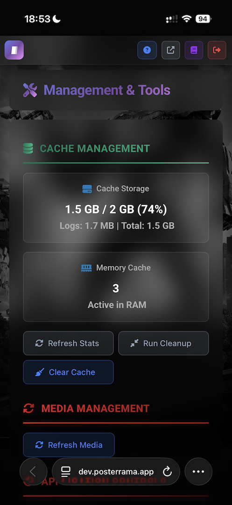

# Posterrama - Bring your media library to life.

Transform any screen into a cinematic, always-fresh movie poster display.

<div align="center">

[](https://github.com/Posterrama/posterrama) [](https://github.com/Posterrama/posterrama/releases) [](#testing) [](#testing) [](https://nodejs.org/) [](./LICENSE)


</div>

---

## 🌟 What can you do with Posterrama?

**Posterrama** transforms any screen into a dynamic, personal cinema experience. Use it as:

- A digital movie wall for your living room, home theater, or office
- A smart, always-fresh screensaver with posters from your own collection
- A stylish showcase for your Plex or Jellyfin library
- A conversation starter or party display

---

## ✨ Features

### 🎬 Screensaver Mode

Turn any screen into a cinematic slideshow. Enjoy smooth, full-screen poster transitions from your own collection. Choose from multiple animation types (fade, slide, zoom, flip, and more) and set the interval for how often posters change. Perfect for ambiance, parties, or just showing off your taste.

**Key features:**

- Multiple animation types: fade, slide, zoom, flip, rotate, and more
- Adjustable transition speed and randomization
- Option to show movie/series info, ratings, and logos
- Works in both landscape and portrait orientation

### 🖼️ Wallart Mode


*Wallart Mode: multi-poster grid with smooth animations*

Display a beautiful grid of posters, updating dynamically with new content. Choose between a full grid or a hero+grid layout (one large featured poster with a 4x4 grid). Each poster can animate in with its own style, and you can customize the number of rows/columns.

**Key features:**

- 13+ animation styles for grid transitions
- Hero+Grid layout or full grid
- Customizable grid size and spacing
- Option to show/hide metadata, ratings, and logos


*Hero+Grid layout variant*

### 🏛️ Cinema Mode

Perfect for vertical screens or digital signage. Show a rotating selection of posters in portrait orientation, with smooth transitions and optional info overlays. Ideal for hallway displays, kiosks, or a true cinema entrance feel.

**Key features:**

- Optimized for portrait/vertical screens
- Smooth poster transitions
- Optional info overlays and ratings

### 📱 Mobile Admin & Responsive Design


*Mobile admin interface*

Configure everything from your phone, tablet, or desktop. The admin dashboard is fully responsive and works on any device.

### ⚡ Blazing Fast Caching & Optimization

Images are loaded instantly thanks to smart caching and optimization. Posters always look sharp, even on 4K displays.

### 🔗 Multiple Content Sources


*Connect your media sources easily*

Connect your Plex or Jellyfin server, or add popular sources like TMDB and TVDB. Your collection is always up to date.

---

## 🔧 Content Source Features

In the admin dashboard, you can configure for each source:

- Enable/disable each source (Plex, Jellyfin, TMDB, TVDB)
- Set server address and authentication (token, username/password)
- Choose which libraries or collections to include
- Filter by genre, year, rating, or watched/unwatched status
- Set update intervals for syncing new content
- Enable/disable adult content or specific genres
- Prioritize sources for poster selection
- Fallback to online sources if local artwork is missing

---


*Fine-tune your display settings*

---

## 🚀 Get Started Instantly

### One-line install

```bash
curl -fsSL https://raw.githubusercontent.com/Posterrama/posterrama/main/install.sh | bash
```

That’s it! Your personal cinema is just one command away.

### Manual install

```bash
git clone https://github.com/Posterrama/posterrama.git
cd posterrama
npm install
npm install -g pm2
pm2 start ecosystem.config.js
```

Open [http://localhost:4000](http://localhost:4000) in your browser to get started.

---

## 🛠️ Configuration & Usage

Go to [http://localhost:4000/admin](http://localhost:4000/admin) to:

- Connect your Plex, Jellyfin, or both
- Choose your favorite display mode (Screensaver, Wallart, Cinema)
- Customize transitions, animations, and scaling
- Show or hide logos, ratings, and metadata
  Everything is managed through a clear dashboard—no coding required.

---

## 📄 License

GPL-3.0-or-later – See [LICENSE](LICENSE) for details.
