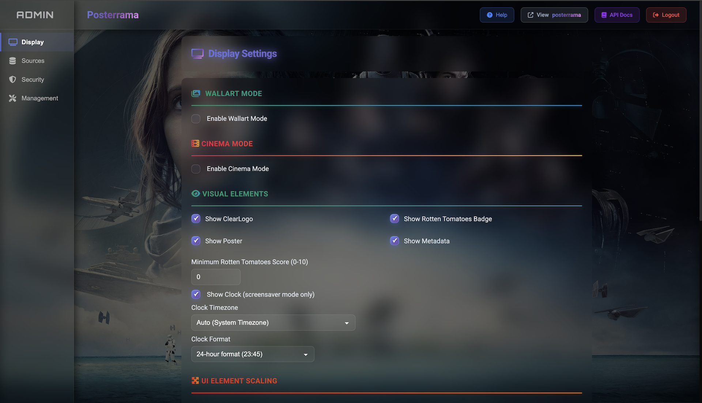

# Posterrama - Bring your media library to life

[](https://github.com/Posterrama/posterrama)
[](https://github.com/Posterrama/posterrama/releases)
[](#testing)
[](#testing)
[](https://nodejs.org/)
[](./LICENSE)
[](https://www.plex.tv/)
[](https://www.themoviedb.org/)

Transform any screen into a **stunning digital movie poster display** that showcases your personal media collection! Perfect for TV screensavers, wall-mounted tablets, or creating your own cinema lobby experience at home.


## 🚀 August 2025 - Major Backend Milestone Achieved!

**We've just completed a massive backend overhaul that transforms Posterrama into a rock-solid foundation!** With comprehensive test coverage now at **84%+** across **726 automated tests**, robust error handling, and enterprise-grade reliability - we're ready to build the future of digital cinema displays.

**What's Next?** The exciting part begins now! 🎬

### 🎯 **Immediate Focus: Polish & Performance**
- **Code cleanup & optimization** - Streamlined debugging and refined architecture
- **Performance enhancements** - Lightning-fast load times and smooth transitions
- **Developer experience** - Clean, maintainable codebase for rapid feature development

### 🌟 **Coming Soon: Game-Changing Features**
Get ready for an explosion of **cinema magic**:

#### **🎭 Cinema Mode Revolution**
- **Movie Trailers Integration** - Watch trailers directly in your poster displays
- **Motion Posters** - Animated movie artwork that brings posters to life
- **Real-time Preview** - See your changes instantly as you configure settings
- **Advanced Animations** - Stunning transitions and cinematic effects

#### **🔌 Universal Content Sources** 
- **Emby & Jellyfin Support** - Connect to any media server you love
- **Kodi Integration** - Seamless integration with your existing setup
- **Radarr, Sonarr & Lidarr** - Rich metadata from your *arr stack
- **Multi-Content Types** - Movies, TV shows, music, and gaming collections

#### **🖥️ Multi-Display Ecosystem**
- **Multiple Screens** - Manage different displays with unique configurations
- **Gaming Collections** - Showcase your Steam, PlayStation, Xbox libraries
- **Music Visualizations** - Album art displays for your music collection
- **Smart Sync** - Coordinated displays across your entire home

#### **✨ Enhanced User Experience**
- **Intuitive Admin Panel** - Beautiful, user-friendly interface redesign
- **Mobile-First Design** - Perfect control from any device
- **One-Click Setup** - Get started in minutes, not hours
- **Smart Recommendations** - AI-powered content curation

**The foundation is set. The future is bright. The next versions will be absolutely incredible!** 🎆

## ✨ What Makes Posterrama Special?

Imagine walking into a movie theater and seeing those beautiful, professional movie posters displayed everywhere. Now imagine having that same cinematic experience in your home, automatically showcasing **your** favorite movies and shows!

### Perfect For:
- **TV Screensavers** - Transform your TV into a cinema display when not in use
- **Wall-Mounted Tablets** - Create permanent digital movie posters for any room
- **Home Theater Lobbies** - Professional cinema experience in your own space
- **Media Room Displays** - Show off your collection in style

### Visual Magic
- **Cinema-Quality Backgrounds** - High-resolution movie artwork with smooth Ken Burns effects
- **Movie Logos & Ratings** - Clean ClearLogo integration with Rotten Tomatoes scores
- **Smart Widgets** - Customizable clock and information overlays
- **Responsive Design** - Looks amazing on any screen size



## ✨ Cool Features That Make It Awesome

### 🎭 Media Server Magic
Connect to your **Plex** server and watch as Posterrama automatically:
- Discovers all your movies and TV shows
- Downloads beautiful backdrop images and movie posters
- Shows ratings, release years, and movie taglines
- Cycles through your collection with smooth transitions

### Content Sources & Discovery
Posterrama connects to multiple sources to bring your media library to life:

**Supported Media Servers:**
- **Plex** - Your personal media server

**Enhanced Metadata Sources:**
- **TMDB** - Rich movie and TV show information
- **TVDB** - Comprehensive TV series database

**Smart Features:**
- Advanced filtering by rating, genre, and release date
- Automatic artwork and metadata enrichment
- Curated collections and trending content
- Professional movie posters and backdrops
Posterrama connects to **The Movie Database (TMDB)** for enhanced content discovery:
- **Curated Collections** - Browse "New Releases" and trending content
- **Global Streaming Providers** - Support for Netflix, Disney+, Prime Video, Apple TV+, Max (HBO), Hulu, Paramount+, and Crunchyroll
- **Worldwide Regions** - Choose from 49+ countries to see region-specific content
- **Smart Filtering** - Customize by rating, genre, and streaming availability
- **Rich Metadata** - Complete movie descriptions, cast info, and detailed ratings

### 📱 Responsive Design
Posterrama works perfectly on any device:
- **Mobile Layout** - Optimized poster and metadata positioning for phones
- **Desktop Experience** - Full descriptions with proper text wrapping
- **TV Optimization** - Clean, readable layouts for large screens
- **Smart Text Display** - Titles and ratings always visible, descriptions intelligently managed

### Clean Admin Interface
Posterrama features a beautifully designed administration panel that makes configuration effortless:
- **Intuitive Dashboard** - Easy-to-navigate interface with clear sections for all settings
- **Media Server Management** - Simple connection setup for Plex servers
- **Library Selection** - Choose exactly which movie and TV libraries to display
- **Visual Customization** - Adjust display timing, transitions, and layout preferences
- **Smart Configuration** - Pre-configured with sensible defaults that work out of the box
- **Responsive Design** - Admin panel works perfectly on desktop, tablet, and mobile devices
- **Secure Access** - Protected with authentication and optional two-factor security

### Security Features
- **Two-Factor Authentication (2FA)** - Keep your setup secure
- **Secure API Keys** - Protected integration with other tools
- **Easy Setup** - Simple web-based configuration
- **Session Management** - Proper authentication and access control

### Android TV Integration
Turn your **Android TV** into a movie poster screensaver using the **Dashboard** screensaver app:

1. Install "Dashboard" screensaver from Google Play Store
2. Set it as your screensaver in Android TV settings
3. Configure Dashboard to display Posterrama: `http://your-posterrama-ip:4000`
4. Enjoy automatic movie posters when your TV is idle!

### Apple TV Setup
While Apple TV doesn't support custom screensavers directly, you can still enjoy Posterrama:

**Option 1: AirPlay Display**
- Open Posterrama in Safari on your iPhone/iPad
- Use AirPlay to mirror to your Apple TV
- Enable "Guided Access" to prevent accidental exits

**Option 2: Apple TV Browser Apps**
- Install a browser app like "Web Browser for Apple TV"
- Navigate to your Posterrama URL: `http://your-posterrama-ip:4000`
- Use it as a manual screensaver when desired

## 🛠️ Easy Installation

### What You'll Need
- **Node.js 18+** (the engine that runs Posterrama)
- **A Media Server** (Plex)
- **5 minutes** of your time!

### Quick Start Guide

1. **Get the Code**
   ```bash
   git clone https://github.com/Posterrama/posterrama.git
   cd posterrama
   ```

2. **Install Everything**
   ```bash
   npm install
   npm install -g pm2
   ```

3. **Start It Up!**
   ```bash
   pm2 start ecosystem.config.js
   ```

4. **Configuration Setup**
   - On first run, Posterrama automatically creates `config.json` from `config.example.json`
   - Your personal `config.json` is **not** tracked in Git, so your settings stay private
   - Safe to pull updates without losing your configuration!

5. **Complete Setup Through Web Interface**
   - Open `http://your-server-ip:4000/admin/setup`
   - Create your admin account (don't forget to enable 2FA!)
   - Connect your media servers (Plex, TMDB, etc.)
   - Select which movie/TV libraries to display
   - Customize your display settings

## 🎮 How to Use

### Main Display
Visit `http://your-server-ip:4000` to see your beautiful movie poster screensaver in action!

### Admin Panel  
Visit `http://your-server-ip:4000/admin` to:
- Connect your media servers
- Choose which libraries to display
- Customize visual settings
- Monitor system health

## � Download & Installation

Ready to get started? Download the latest version of Posterrama:

[](https://github.com/Posterrama/posterrama/releases/latest)

### Quick Installation Options:

**Option 1: Direct Download**
- Download the latest release from [GitHub Releases](https://github.com/Posterrama/posterrama/releases/latest)
- Extract the files to your preferred directory
- Follow the included installation guide

**Option 2: Git Clone**
```bash
git clone https://github.com/Posterrama/posterrama.git
cd posterrama
npm install
npm start
```

**Option 3: Docker** *(Coming Soon)*
```bash
docker run -p 4000:4000 posterrama/posterrama
```

### System Requirements:
- **Node.js** 18.0.0 or higher
- **Operating System**: Linux, Windows, macOS
- **Hardware**: Works great on Raspberry Pi 4+ for dedicated displays
- **Browser**: Modern web browser with JavaScript enabled

## �🔧 Troubleshooting Made Simple

**Not seeing any movies?**
- Check your media server connection in the admin panel
- Make sure you've selected at least one library to display
- Verify your Plex token has the right permissions

**Display looks weird?**
- Try different screen resolutions
- Check if your browser supports modern web features
- Clear your browser cache

**Can't access admin panel?**
- Make sure you're using the right IP address and port
- Check if 2FA is enabled and you have the right code
- Try clearing cookies and logging in again

## 💡 Pro Tips

- **For best results**: Use high-quality movie artwork in your media server
- **Performance**: Posterrama works great on Raspberry Pi 4+ for dedicated displays
- **Multiple displays**: Run multiple Posterrama instances for different rooms
- **Customize everything**: The admin panel lets you tweak colors, timing, and display options

## 📜 License

This project is **free and open source** under the GPL-3.0-or-later license. You can use it, modify it, and share it - just keep it open source too!

---

**Ready to transform your space into a personal cinema?**

*Posterrama - Because your movie collection deserves to be seen!*
