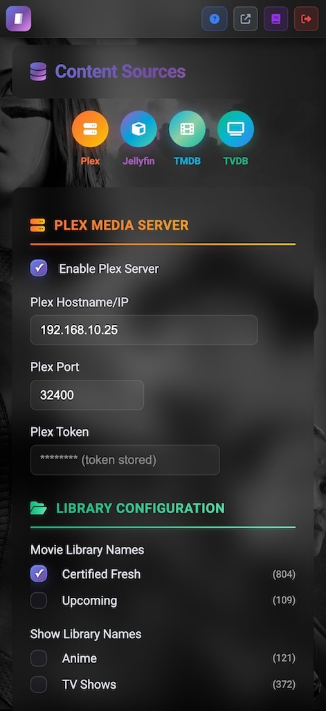
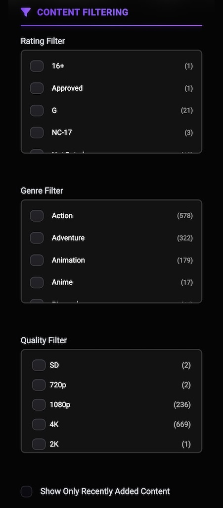
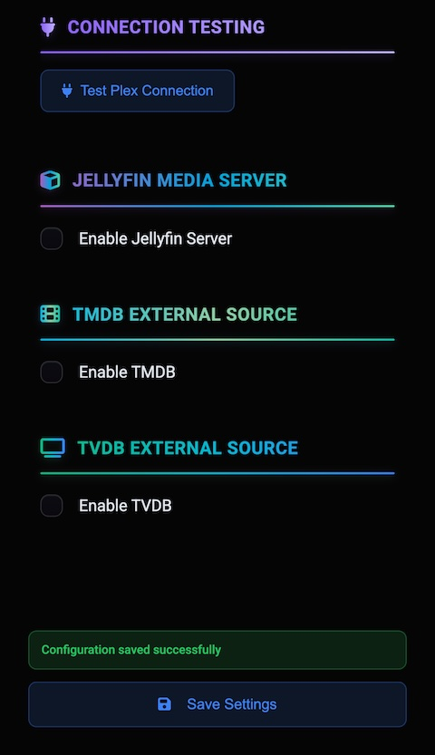
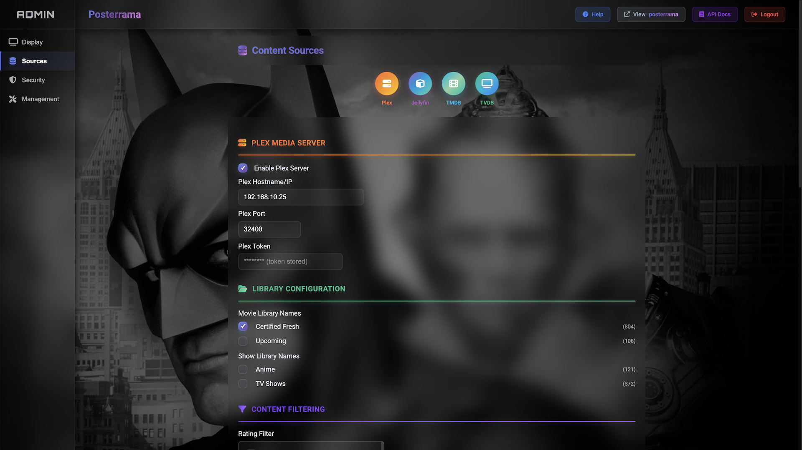
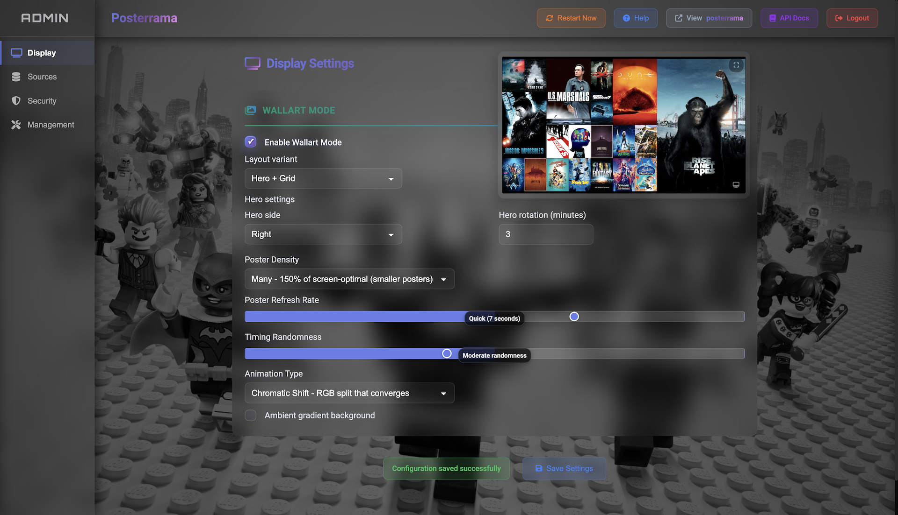
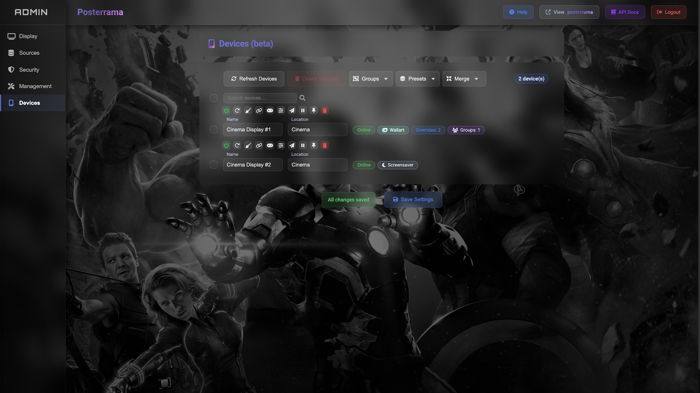

# Posterrama - Bring your media library to life.

Transform any screen into a cinematic, always-fresh movie poster display.

<div align="center">

[](https://github.com/Posterrama/posterrama) [](https://github.com/Posterrama/posterrama/releases) [](#testing) [](#testing) [](https://nodejs.org/) [](./LICENSE)

<p style="margin: 6px 0 0 0;">
  <a href="https://www.plex.tv/"></a>
  <a href="https://jellyfin.org/"></a>
  <a href="https://www.themoviedb.org/"></a>
  <a href="https://thetvdb.com/"></a>
  

</p>


 </div>

---

## 🌟 What can you do with Posterrama?

**Posterrama** transforms any screen into a dynamic, personal cinema experience. Use it as:

- A digital movie wall for your living room, home theater, or office
- A smart, always-fresh screensaver with posters from your own collection
- A stylish showcase for your Plex or Jellyfin library
- A conversation starter or party display

---

## ✨ Features

### 🎬 Screensaver Mode

<figure>
  
  <figcaption style="text-align:left; color:#6a6a6a;"><em>
    Screensaver Mode feels like a living poster wall—bold artwork gliding in and out, always fresh and cinematic.
  </em></figcaption>
  
</figure>

Turn any screen into a cinematic slideshow. Enjoy smooth, full-screen poster transitions from your own collection. Choose from multiple animation types (fade, slide, zoom, flip, and more) and set the interval for how often posters change. Perfect for ambiance, parties, or just showing off your taste.

**Key features:**

- Multiple animation types: fade, slide, zoom, flip, rotate, and more
- Adjustable transition speed and randomization
- Option to show movie/series info, ratings, and logos
- Works in both landscape and portrait orientation

### 🖼️ Wallart Mode

<figure>
  
  <figcaption style="text-align:left; color:#6a6a6a;"><em>Wallart Mode: multi-poster grid with smooth animations</em></figcaption>
  
</figure>

Display a beautiful grid of posters, updating dynamically with new content. Choose between a full grid or a hero+grid layout (one large featured poster with a 4x4 grid). Posters slide in smoothly, and you can choose between preset grid sizes.

**Key features:**

- 13+ animation styles for grid transitions
- Hero+Grid layout or full grid
- Customizable grid size and spacing

<figure>
  
  <figcaption style="text-align:left; color:#6a6a6a;"><em>Hero+Grid layout variant</em></figcaption>
  
</figure>

### 🏛️ Cinema Mode

Perfect for vertical screens or digital signage. Show a rotating selection of posters in portrait orientation, with smooth transitions and optional info overlays. Ideal for hallway displays, kiosks, or a true cinema entrance feel.

**Key features:**

- Optimized for portrait/vertical screens
- Smooth poster transitions
- Optional info overlays and ratings

### 📱 Mobile Admin & Responsive Design

<div align="center" style="margin: 8px 0;">
  
  
  
  
</div>

Configure everything from your phone, tablet, or desktop. The admin dashboard is fully responsive and works on any device.

### ⚡ Realtime Preview

See changes instantly while you configure. Most settings hot‑reload without a restart; the display updates in real time as you tweak options in the admin.

### ⚡ Blazing Fast Caching & Optimization

Images are loaded instantly thanks to smart caching and optimization. Posters always look sharp, even on 4K displays.

### 🔗 Multiple Content Sources

<figure>
  
  <figcaption style="text-align:left; color:#6a6a6a;"><em>Connect your media sources easily</em></figcaption>
  
</figure>

Connect your Plex or Jellyfin server, or add popular sources like TMDB and TVDB. Your collection is always up to date.

---

## 🔧 Content Source Features

In the admin dashboard, you can configure for each source:

- Enable/disable each source (Plex, Jellyfin, TMDB, TVDB)
- Set server address and authentication (token, username/password)
- Choose which libraries or collections to include
- Filter by genre, rating, or quality

---

<figure>
  
  <figcaption style="text-align:left; color:#6a6a6a;"><em>Fine-tune your display settings</em></figcaption>
  
</figure>

### 🖥️ Device Management (BETA)

<figure>
  
  <figcaption style="text-align:left; color:#6a6a6a;"><em>Manage devices live: status, playback, and per‑device overrides</em></figcaption>
</figure>

Control all connected displays from the Admin dashboard:

- Live controls per device: previous/next, play/pause toggle, pin current poster, and reload/reset
- Clear status badge: Offline (grey), Online (green), Live (blue)
- Controls auto‑disable when a device is offline
- Per‑device Display Settings override with JSON editor and presets; apply live over WebSocket
- WebSocket heartbeat keeps status and playback state in sync with the device

Tooltips explain each control and status for quick onboarding. Overrides merge on top of global settings without affecting other devices.

---

## 🔊 Coming Soon — turn it up to eleven

A quick peek at what's next. We're actively building these high‑impact upgrades to make Posterrama even more powerful and fun.

**🎬 Cinema & Visual Experience**

- [ ] Cinema mode: major expansion planned with many new features
- [ ] Advanced transition effects
- [ ] Motion posters with AI
- [ ] Now playing mode (cinema)
- [ ] Trailer support

**🎨 Customization & Design**

- [ ] Font/size/color customization

**📚 Media Sources & Libraries**

- [ ] Local photo directory support
- [ ] Emby integration
- [ ] Additional poster services
- [ ] Music library support
- [ ] Radarr/Sonarr/Lidarr integration
- [ ] Steam and ROMM gaming libraries and collections

And that's just the beginning — much more is on the way.

## 🚀 Get Started Instantly

### One-line install

```bash
curl -fsSL https://raw.githubusercontent.com/Posterrama/posterrama/main/install.sh | bash
```

### Manual install (Debian-based distros)

```bash
# Install prerequisites (Debian/Ubuntu/Raspberry Pi OS)
sudo apt-get update
sudo apt-get install -y git curl build-essential

# Install Node.js (v18 LTS recommended)
curl -fsSL https://deb.nodesource.com/setup_18.x | sudo -E bash -
sudo apt-get install -y nodejs

# Verify
node -v
npm -v

# Install Posterrama
git clone https://github.com/Posterrama/posterrama.git
cd posterrama
npm install
npm install -g pm2
pm2 start ecosystem.config.js
pm2 save
```

## 🛠️ Configuration & Usage

Go to http://your-posterrama-ip:4000/admin to:

Everything is managed through a clear dashboard—no coding required.

### 🔌 Platform Integration

#### Android TV

1. Install "Dashboard" screensaver from Google Play
2. Set as screensaver in Android TV settings
3. Configure: http://your-posterrama-ip:4000

---

## 📄 License

GPL-3.0-or-later – See [LICENSE](LICENSE) for details.
