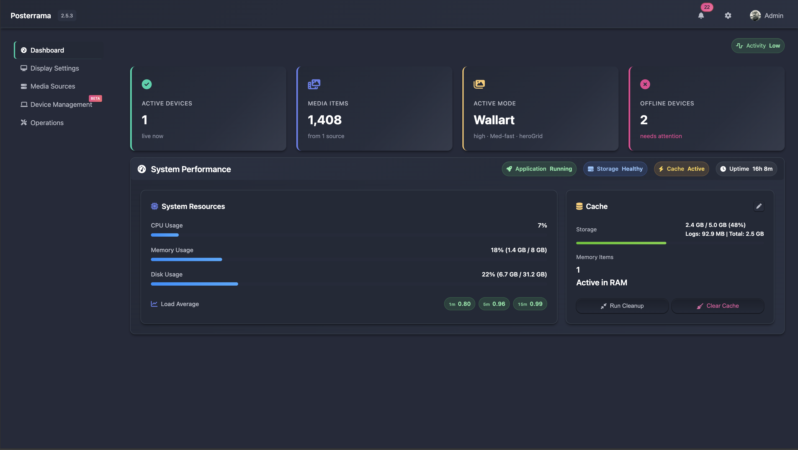
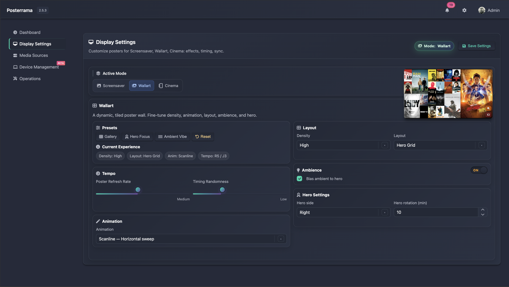
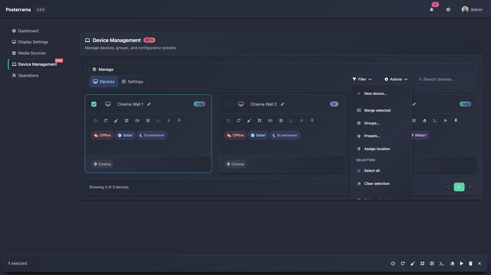

<div align="center">
  
  
  <h1 style="margin-bottom: 5px;">Posterrama - Bring your media library to life.</h1>
  <p style="margin-top: 0;"><em>Transform any screen into a cinematic, always-fresh movie poster display.</em></p>
  <br>
</div>

<div align="center">

<p style="margin: 0; line-height: 1.1;">
  <a href="https://github.com/Posterrama/posterrama"></a>
  <a href="https://github.com/Posterrama/posterrama/releases"></a>
  <a href="https://nodejs.org/"></a>
  <a href="./LICENSE"></a>
</p>
<p style="margin: 2px 0 8px 0; line-height: 1.1;">
  <a href="#multiple-content-sources"></a>
  <a href="#multiple-content-sources"></a>
  <a href="#multiple-content-sources"></a>
  <a href="https://redocly.github.io/redoc/?url=https://raw.githubusercontent.com/Posterrama/posterrama/main/docs/openapi-latest.json" target="_blank" rel="noopener noreferrer"></a>
</p>


</div>

---

## What you can do with Posterrama

**Posterrama** transforms any screen into a dynamic, personal cinema experience. Use it as:

- A digital movie poster display — turn any TV or monitor into a cinematic foyer piece that continuously showcases your collection with studio‑grade artwork
- A digital movie wall for your living room, home theater, or office
- A smart, always-fresh screensaver with posters from your own collection
- A stylish showcase for your Plex or Jellyfin library
- A gaming gallery — display your retro and modern game covers from RomM with dedicated games-only mode in Wallart
- A conversation starter or party display

---

## Features

### Screensaver mode

<figure>
  
  <figcaption style="text-align:left; color:#6a6a6a;"><em>
    Screensaver Mode feels like a living poster wall—bold artwork gliding in and out, always fresh and cinematic.
  </em></figcaption>
  
</figure>

Turn any screen into a cinematic slideshow. Enjoy smooth, full-screen poster transitions from your own collection. Choose from multiple animation types (fade, slide, zoom, flip, and more) and set the interval for how often posters change. Perfect for ambiance, parties, or just showing off your taste.

**Key features:**

- Multiple animation types: fade, slide, zoom, flip, rotate, and more
- Adjustable transition speed and randomization
- Option to show movie/series info, ratings, and logos
- Works in both landscape and portrait orientation

### Wallart mode

<figure>
  
  <figcaption style="text-align:left; color:#6a6a6a;"><em>Wallart Mode: multi-poster grid with smooth animations</em></figcaption>
  
</figure>

Display a beautiful grid of posters, updating dynamically with new content. Choose between a full grid or a hero+grid layout (one large featured poster with a 4x4 grid). Posters slide in smoothly, and you can choose between preset grid sizes.

**Key features:**

- 13+ animation styles for grid transitions
- Hero+Grid layout or full grid
- Customizable grid size and spacing

<figure>
  
  <figcaption style="text-align:left; color:#6a6a6a;"><em>Hero+Grid layout variant</em></figcaption>
  
</figure>

**Games Mode** — Display your game collection from RomM in Wallart. Games mode showcases your retro and modern game covers with the same beautiful grid layouts and animations.

<figure>
  
  <figcaption style="text-align:left; color:#6a6a6a;"><em>Games-only mode: showcase your retro and modern game collection from RomM</em></figcaption>
  
</figure>

**Music Mode** — Transform your Wallart display into an album art gallery. Music mode integrates with your Plex music library to showcase square album covers in beautiful grid layouts with customizable metadata overlays.

<figure>
  
  <figcaption style="text-align:left; color:#6a6a6a;"><em>Artist Cards display: full-screen artist photos with album covers and metadata</em></figcaption>
  
</figure>

<figure>
  
  <figcaption style="text-align:left; color:#6a6a6a;"><em>Album covers grid: clean, minimal display focused on artwork</em></figcaption>
  
</figure>

**Key features:**

- Three display styles: covers-only (minimal grid), album-info (with metadata), artist-cards (full-screen artist showcase)
- Artist Cards mode: cinematic split-screen with artist photo, album covers, and rotating album display
- Square album cover display optimized for music artwork
- Configurable grid sizes (3×3 to 6×6) for covers-only and album-info styles
- Customizable rotation intervals for both artists and album covers
- Smart Mix sorting with adjustable weights for recent, popular, and random albums
- Filter by genre, artist, or minimum rating
- Multiple animation styles including vinyl-spin, slide-fade, crossfade, and flip
- Respects Plex ratings and music metadata

### Cinema mode

Perfect for vertical screens or digital signage. Show a rotating selection of posters in portrait orientation, with smooth transitions and optional info overlays. Ideal for hallway displays, kiosks, or a true cinema entrance feel.

**Key features:**

- Optimized for portrait/vertical screens
- Smooth poster transitions
- Optional info overlays and ratings
- Now Playing mode — automatically displays posters from active Plex sessions. Perfect for showing what's currently being watched in real-time, with automatic fallback to rotation when playback stops

### Dashboard

<figure>
  
  <figcaption style="text-align:left; color:#6a6a6a;"><em>At‑a‑glance status, KPIs, recent activity, and quick actions</em></figcaption>
  
</figure>

Get a clear overview of your setup the moment you sign in. The Dashboard highlights system health, key metrics, recent events, connected devices, and quick links to common tasks — so you can spot issues and act fast.

<!-- Realtime preview moved into Display Settings as a bullet point -->

### Multiple content sources

<figure>
  
  <figcaption style="text-align:left; color:#6a6a6a;"><em>Connect your media sources easily</em></figcaption>
  
</figure>

Connect your Plex or Jellyfin server, add popular sources like TMDB, or showcase your game collection from RomM. Your collection is always up to date.

Local library: Add your own artwork with a simple upload—posters, cinematic backgrounds, motion posters, or complete posterpacks. You can also create shareable posterpacks directly from your Plex or Jellyfin libraries. New packs are picked up automatically—no unzipping or manual steps—and are instantly available in Screensaver, Wallart, and Cinema.

<!-- Content source features heading and intro removed per request; keep the actionable bullets below -->
 <!-- Content source features heading and intro removed per request; keep the actionable bullets below -->

- Enable/disable each source (Plex, Jellyfin, TMDB, RomM)
- Set server address and authentication (token, username/password)
- Choose which libraries or collections to include
- Filter by genre, rating, or quality
- Games-only mode for RomM: display only game covers in Wallart
- Music mode for Plex: showcase your music library with square album art and metadata overlays

---

### Display Settings

<figure>
  
  <figcaption style="text-align:left; color:#6a6a6a;"><em>Fine-tune your display settings</em></figcaption>
  
</figure>

- Realtime preview — see changes instantly while you configure. Most settings hot‑reload without a restart; the display updates live as you tweak options.

### Device management (beta)

<figure>
  
  <figcaption style="text-align:left; color:#6a6a6a;"><em>Manage devices live: status, playback, and per‑device overrides</em></figcaption>
</figure>

Orchestrate every Posterrama screen from a single, real‑time dashboard. Device Management shows live status, lets you control playback, and apply per‑device Display Settings without interrupting the experience. Whether you run one TV at home or a whole foyer of screens, changes land instantly over a lightweight WebSocket channel.

What you can do:

- Live controls per device: previous/next, play/pause toggle, pin current poster, and reload/reset
- Clear status badges: Offline (grey), Online (green), Live (blue)
- Controls auto‑disable when a device is offline
- Per‑device Display Settings override with JSON editor and presets; apply live over WebSocket
- WebSocket heartbeat keeps status and playback state in sync with the device

Where it shines:

- At home — Quickly pause a screen when you get a call, pin a specific poster for a movie night, or tailor one display's look (mode, grid density, info overlays) without touching the others.
- In commercial cinemas and venues — Keep foyer and hallway displays fresh and on‑brand. Swap promos in seconds, verify screens are healthy at a glance, and minimize downtime with one‑click reload/reset.

---

### Home Assistant integration


Connect your Posterrama displays to Home Assistant via MQTT and make them part of your smart home. Each display appears as a media player with full controls and customizable settings—all through the Home Assistant interface you already know.

What you get:

- **Media player controls**: Play, pause, next/previous poster, and see what's currently showing
- **50+ customization options**: Change display mode, animation style, transition speed, poster info visibility, and more—all exposed as switches, selects, and numbers in Home Assistant
- **Smart home integration**: Trigger display changes with scenes, automations, or schedules. Pause displays when movies start, switch to cinema mode for movie night, or rotate content based on time of day
- **Real-time sync**: Changes in Posterrama instantly update in Home Assistant, and vice versa
- **Multiple displays**: Manage all your screens individually or group them together

<br clear="left"/>

Perfect for:

- **Home theaters**: Automatically switch displays when you start a movie
- **Smart scenes**: Adjust poster displays as part of "Movie Night" or "Party Mode" scenes
- **Scheduling**: Show different content during daytime vs. evening
- **Voice control**: "Hey Google, next poster" or "Alexa, pause the display"

Setup is straightforward—just enable MQTT in Posterrama settings, point it to your MQTT broker, and your displays appear in Home Assistant automatically. No manual configuration needed.

---

### Technical features

- Smart multi‑tier caching (memory + disk) with intelligent expiration
- Optimized image pipeline for fast loads and crisp 4K output
- Efficient WebSocket updates for live device control and instant settings apply
- Robust logging with compact Notification Center (filters, levels)
- Resilient configuration (/get-config) with schema validation and safe defaults
- API-first design with OpenAPI docs at /api-docs

## System requirements

**Minimum recommended:**

- **RAM**: 2GB minimum, 4GB+ recommended for larger libraries (5000+ items)
- **Storage**: 2GB for application + cache space for images
- **OS**: Linux (Ubuntu, Debian, CentOS, RHEL), macOS, or Windows with Node.js support
- **Node.js**: v20 LTS or higher
- **Network**: Stable connection to media servers (Plex/Jellyfin)

**Performance notes:**

- Posterrama automatically uses up to 8GB heap memory for large libraries
- Image caching reduces bandwidth after initial load

## Get started

### One-line install

```bash
curl -fsSL https://raw.githubusercontent.com/Posterrama/posterrama/main/install.sh | bash
```

### Manual install (Debian-based distros)

```bash
# Install prerequisites (Debian/Ubuntu/Raspberry Pi OS)
sudo apt-get update
sudo apt-get install -y git curl build-essential

# Install Node.js (v20 LTS recommended)
curl -fsSL https://deb.nodesource.com/setup_20.x | sudo -E bash -
sudo apt-get install -y nodejs

# Verify
node -v
npm -v

# Install Posterrama
git clone https://github.com/Posterrama/posterrama.git
cd posterrama
npm install
npm install -g pm2
pm2 start ecosystem.config.js
pm2 startup
pm2 save
```

## Configuration and usage

Go to http://your-posterrama-ip:4000/admin to:

Everything is managed through a clear dashboard—no coding required.

### Platform integration

#### Android TV

1. Install "Dashboard" screensaver from Google Play
2. Set as screensaver in Android TV settings
3. Configure: http://your-posterrama-ip:4000

---

## License

GPL-3.0-or-later – See [LICENSE](LICENSE) for details.
