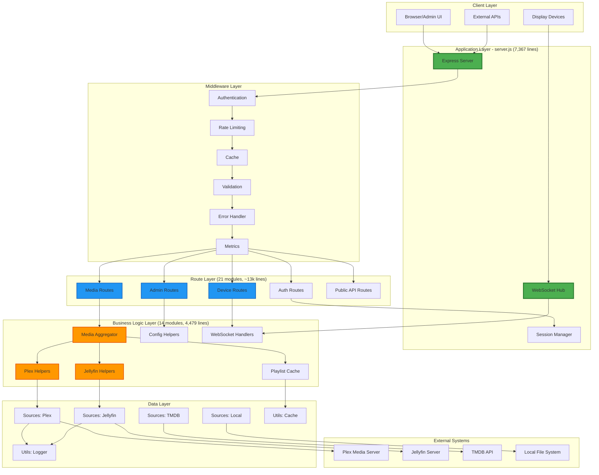
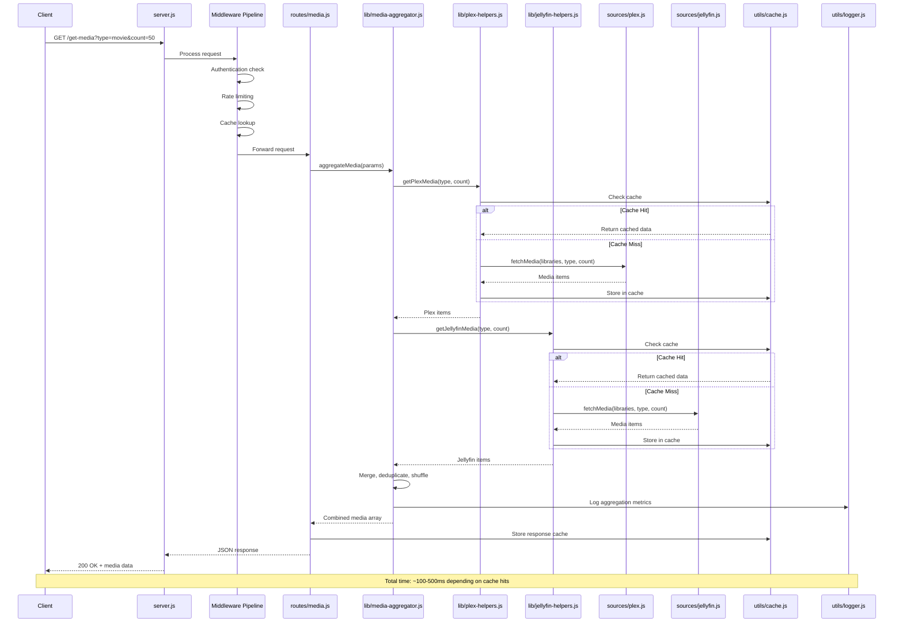
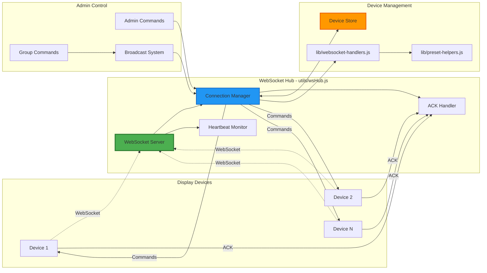
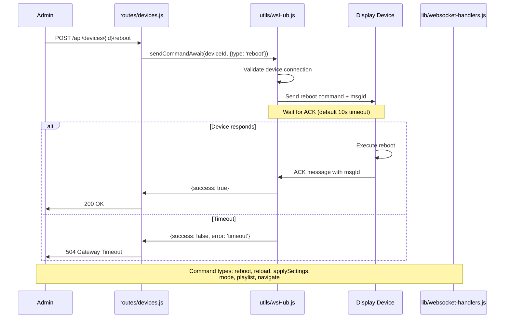
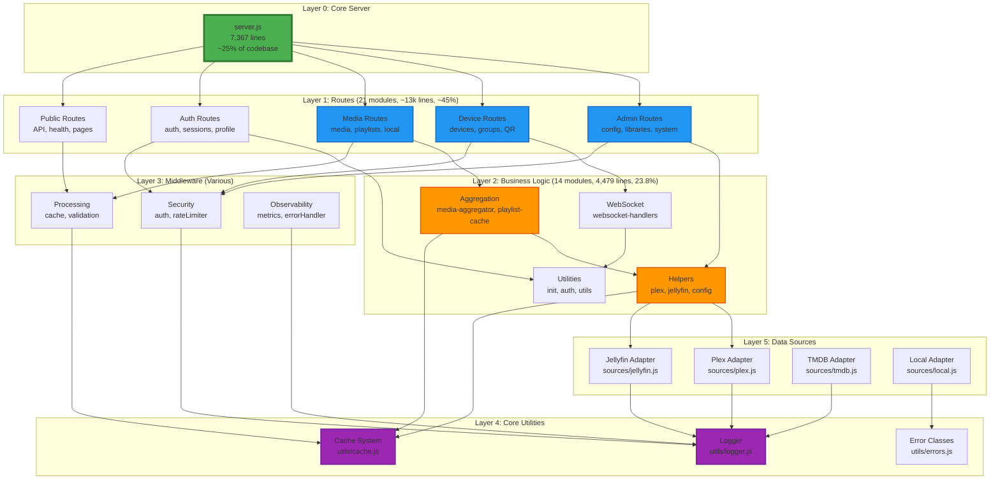
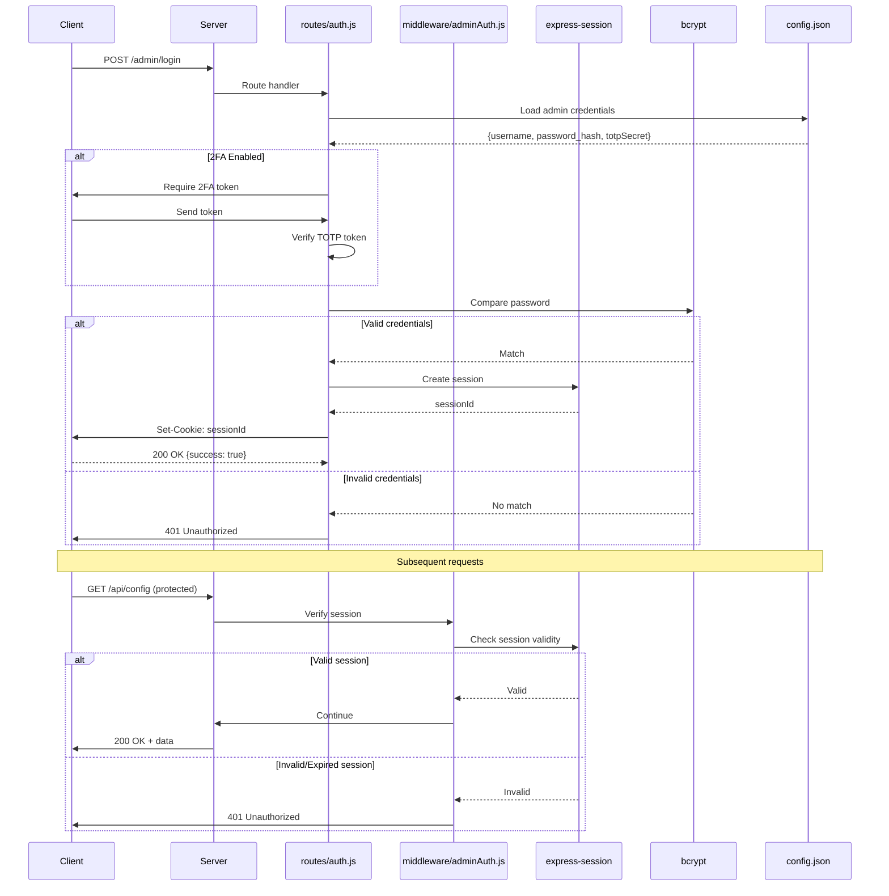
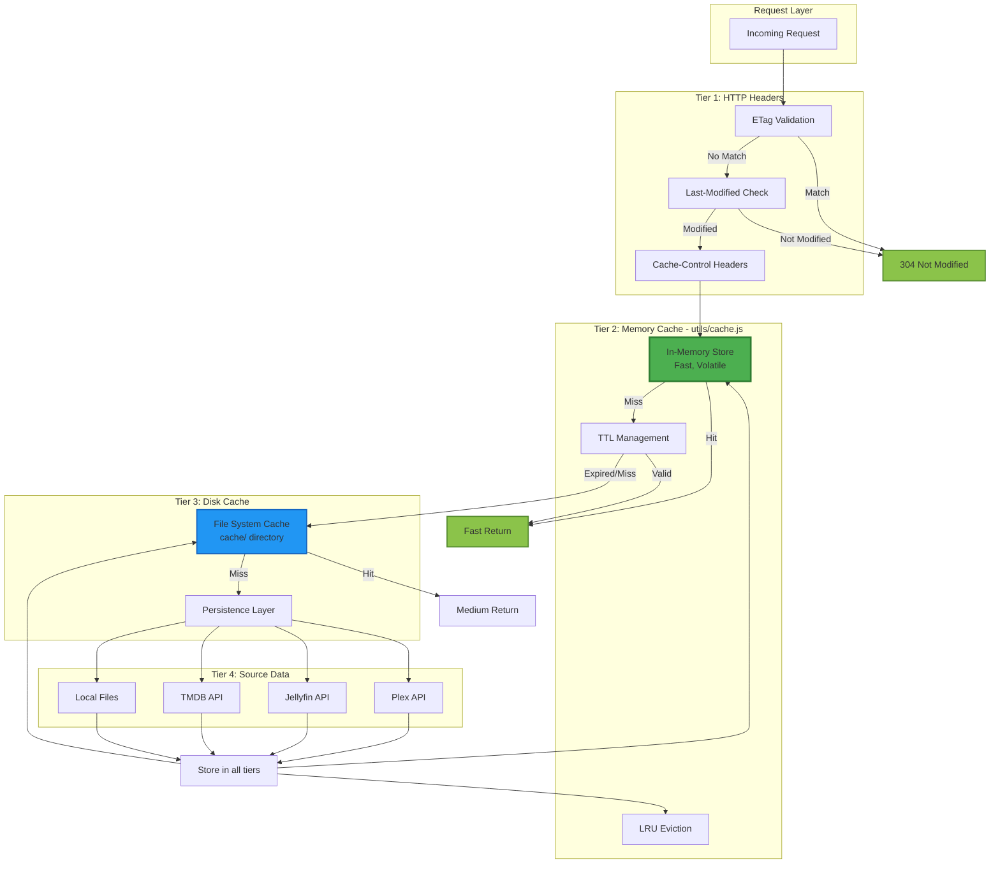
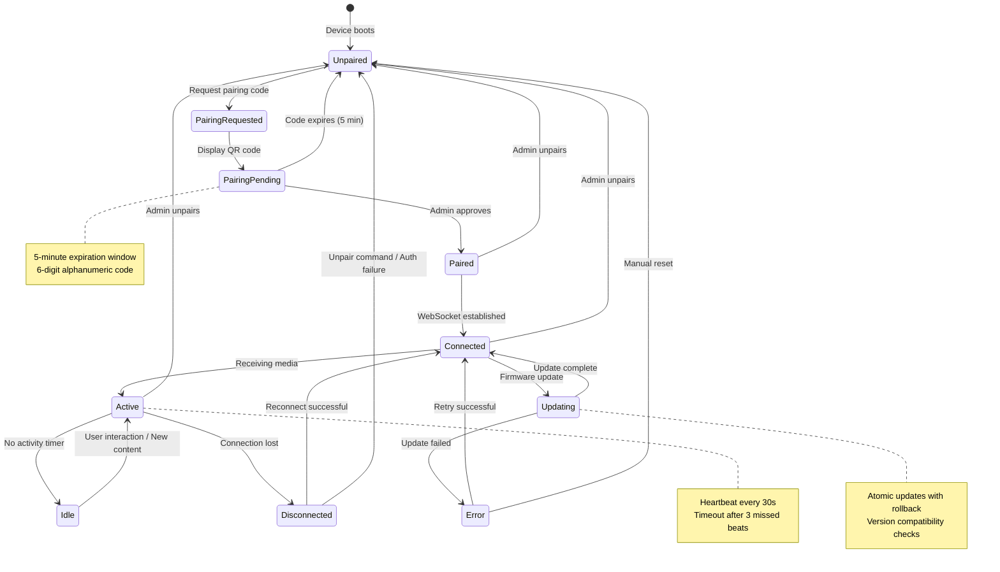
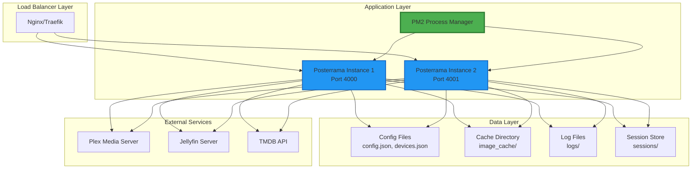
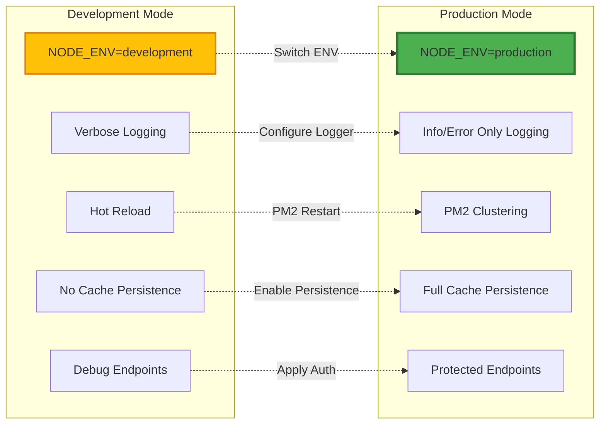

# Posterrama Architecture Diagrams

**Version**: 2.9.8
**Last Updated**: 2025-11-28
**Server Size**: 7,367 lines (Refactored from ~20k lines)

---

## Overview

This document provides visual representations of Posterrama's modular architecture, request flows, and system interactions. All diagrams use Mermaid format for inline rendering in GitHub and VS Code.

---

## ️ High-Level System Architecture



---

## Request Flow: Media Aggregation

Shows the complete flow from client request to media delivery:



---

## WebSocket Architecture

Device communication and real-time control:



### WebSocket Message Flow



---

## Module Organization

Layered view of the codebase structure:



---

## Authentication & Authorization Flow



---

## Caching Architecture

Multi-tier caching strategy for optimal performance:



### Cache TTL Strategy

| Data Type        | Memory TTL | Disk TTL   | Reasoning                 |
| ---------------- | ---------- | ---------- | ------------------------- |
| Media Posters    | 1 hour     | 7 days     | Images rarely change      |
| Library Metadata | 5 minutes  | 1 hour     | Frequent updates possible |
| Playlist Data    | 2 minutes  | 15 minutes | Dynamic content           |
| Device Settings  | 1 minute   | N/A        | Real-time updates needed  |
| Config Data      | 30 seconds | N/A        | Admin changes immediate   |

---

## Device Lifecycle

State management for display devices:



---

## Metrics & Observability

Data flow for monitoring and metrics:

```mermaid
graph LR
 subgraph "Request Events"
 R1[HTTP Requests]
 R2[WebSocket Messages]
 R3[Background Jobs]
 end

 subgraph "Middleware - middleware/metrics.js"
 M1[Request Counter]
 M2[Response Timer]
 M3[Error Tracker]
 end

 subgraph "Metrics Store - utils/metrics.js"
 MS[Metrics Aggregator]
 MC[Metric Categories]
 end

 subgraph "Sources Metrics"
 SM1[Plex Metrics]
 SM2[Jellyfin Metrics]
 SM3[Cache Metrics]
 end

 subgraph "Logging - utils/logger.js"
 L1[Winston Logger]
 L2[File Transport]
 L3[Console Transport]
 L4[Memory Buffer]
 end

 subgraph "Admin Interface"
 A1[/api/admin/metrics]
 A2[/api/admin/logs/stream]
 A3[/api/health]
 end

 R1 --> M1
 R2 --> M1
 R3 --> M1

 M1 --> M2
 M2 --> M3
 M3 --> MS

 SM1 --> MS
 SM2 --> MS
 SM3 --> MS

 MS --> MC
 MC --> A1

 M1 --> L1
 M2 --> L1
 M3 --> L1

 L1 --> L2
 L1 --> L3
 L1 --> L4

 L4 --> A2
 MS --> A3

 style MS fill:#4CAF50,stroke:#2E7D32,stroke-width:3px
 style L1 fill:#2196F3,stroke:#1565C0,stroke-width:2px
 style MC fill:#FF9800,stroke:#E65100,stroke-width:2px
```

---

## Deployment Architecture

Production environment setup:



---

## Development vs Production



---

## Related Documentation

- [MODULE-ARCHITECTURE.md](./MODULE-ARCHITECTURE.md) - Detailed module structure
- [DEPENDENCY-GRAPH.md](./DEPENDENCY-GRAPH.md) - Module dependency mapping
- [DEVELOPMENT.md](./DEVELOPMENT.md) - Development setup
- [SERVER-REFACTORING-PLAN.md](./SERVER-REFACTORING-PLAN.md) - Refactoring history

---

## Diagram Maintenance

**Update these diagrams when**:

- Adding new routes or modules
- Changing request flow patterns
- Modifying WebSocket behavior
- Updating caching strategy
- Adding new data sources
- Changing authentication flow
- Altering deployment architecture

**Tools for editing**:

- [Mermaid Live Editor](https://mermaid.live/) - Online diagram editor
- VS Code Extension: `bierner.markdown-mermaid` - Preview in editor
- GitHub - Native Mermaid rendering in markdown

---

**Document Version**: 1.0.0
**Last Review**: 2025-01-20
**Next Review**: When adding new major features
