# Posterrama Module Dependency Graph

**Version**: 3.0.0
**Last Updated**: 2025-12-14
**Refactoring Status**: Server size 7,666 lines (from ~20k lines)

---

## Overview

This document maps the dependency relationships between Posterrama's modules (server.js + 21 routes + lib + utils). Understanding these dependencies is crucial for:

- **Refactoring**: Identify tightly coupled modules
- **Testing**: Understand what mocks are needed
- **Debugging**: Trace data flow through the system
- **Optimization**: Find caching opportunities

---

## ️ Complete Dependency Map

### Visual Dependency Graph

```mermaid
graph TB
 %% Core Server
 SERVER[server.js<br/>7,666 lines]

 %% Route Modules (21)
 R_CONFIG[routes/admin-config.js]
 R_LIB[routes/admin-libraries.js]
 R_OBSERVABLE[routes/admin-observable.js]
 R_CACHE[routes/admin-cache.js]
 R_LOGS[routes/admin-logs.js]
 R_PERF[routes/admin-performance.js]
 R_AUTH[routes/auth.js]
 R_BACKUPS[routes/config-backups.js]
 R_CONFIG_PUB[routes/config-public.js]
 R_DEVICES[routes/devices.js]
 R_PAGES[routes/frontend-pages.js]
 R_PROFILES[routes/profiles.js]
 R_HEALTH[routes/health.js]
 R_LOCAL[routes/local-directory.js]
 R_MEDIA[routes/media.js]
 R_METRICS[routes/metrics-testing.js]
 R_SRC_ERR[routes/source-error-metrics.js]
 R_PHOTO[routes/profile-photo.js]
 R_PUBLIC[routes/public-api.js]
 R_QR[routes/qr.js]
 R_RATINGS[routes/quality-ratings.js]

 %% Lib Modules (14)
 L_AUTH[lib/auth-helpers.js]
 L_CACHE[lib/cache-utils.js]
 L_CONFIG[lib/config-helpers.js]
 L_INIT[lib/init.js]
 L_JELLYFIN[lib/jellyfin-helpers.js]
 L_LOCAL_INIT[lib/local-directory-init.js]
 L_AGGREGATOR[lib/media-aggregator.js]
 L_PLEX[lib/plex-helpers.js]
 L_PLAYLIST[lib/playlist-cache.js]
 L_DEVICE_OPS[lib/device-operations.js]
 L_SERVER_TEST[lib/server-test-helpers.js]
 L_SOURCE_UTILS[lib/source-utils.js]
 L_UTILS[lib/utils-helpers.js]
 L_REALTIME[lib/realtime-server.js]

 %% Middleware
 MW_ADMIN[middleware/adminAuth.js]
 MW_CACHE[middleware/cache.js]
 MW_ERROR[middleware/errorHandler.js]
 MW_INDEX[middleware/index.js]
 MW_METRICS[middleware/metrics.js]
 MW_RATE[middleware/rateLimiter.js]
 MW_VALIDATE[middleware/validate.js]

 %% Utils
 U_CACHE[utils/cache.js]
 U_CONFIG_BACKUP[utils/configBackup.js]
 U_DEVICE[utils/deviceStore.js]
 U_ERRORS[utils/errors.js]
 U_PROFILES[utils/profilesStore.js]
 U_LOGGER[utils/logger.js]
 U_METRICS[utils/metrics.js]
 U_PLEX_HTTP[utils/plex-http-client.js]
 U_JELLYFIN_HTTP[utils/jellyfin-http-client.js]
 U_WSHUB[utils/wsHub.js]

 %% Sources
 S_PLEX[sources/plex.js]
 S_JELLYFIN[sources/jellyfin.js]
 S_TMDB[sources/tmdb.js]
 S_LOCAL[sources/local.js]

 %% Server Dependencies
 SERVER --> R_CONFIG
 SERVER --> R_LIB
 SERVER --> R_OBSERVABLE
 SERVER --> R_CACHE
 SERVER --> R_LOGS
 SERVER --> R_PERF
 SERVER --> R_AUTH
 SERVER --> R_BACKUPS
 SERVER --> R_CONFIG_PUB
 SERVER --> R_DEVICES
 SERVER --> R_PAGES
 SERVER --> R_PROFILES
 SERVER --> R_HEALTH
 SERVER --> R_LOCAL
 SERVER --> R_MEDIA
 SERVER --> R_METRICS
 SERVER --> R_SRC_ERR
 SERVER --> R_PHOTO
 SERVER --> R_PUBLIC
 SERVER --> R_QR
 SERVER --> R_RATINGS
 SERVER --> MW_INDEX
 SERVER --> L_INIT
 SERVER --> U_LOGGER
 SERVER --> U_WSHUB

 %% Route -> Lib Dependencies
 R_CONFIG --> L_CONFIG

 R_CONFIG --> U_CONFIG_BACKUP

 R_LIB --> L_PLEX
 R_LIB --> L_JELLYFIN
 R_LIB --> L_SERVER_TEST

 R_AUTH --> L_AUTH
 R_AUTH --> MW_RATE

 R_BACKUPS --> U_CONFIG_BACKUP

 R_DEVICES --> L_DEVICE_OPS
 R_DEVICES --> U_DEVICE
 R_DEVICES --> U_WSHUB

 R_PAGES --> L_INIT

 R_PROFILES --> U_PROFILES

 R_LOCAL --> L_LOCAL_INIT
 R_LOCAL --> L_PLEX
 R_LOCAL --> L_JELLYFIN
 R_LOCAL --> S_LOCAL

 R_MEDIA --> L_AGGREGATOR
 R_MEDIA --> L_PLAYLIST
 R_MEDIA --> L_CACHE

 R_PHOTO --> L_UTILS

 %% Lib -> Lib Dependencies
 L_AGGREGATOR --> L_PLEX
 L_AGGREGATOR --> L_JELLYFIN
 L_AGGREGATOR --> L_PLAYLIST
 L_AGGREGATOR --> L_SOURCE_UTILS

 L_PLAYLIST --> L_CACHE
 L_PLAYLIST --> L_AGGREGATOR

 L_PLEX --> L_CACHE
 L_PLEX --> U_PLEX_HTTP
 L_PLEX --> S_PLEX

 L_JELLYFIN --> L_CACHE
 L_JELLYFIN --> U_JELLYFIN_HTTP
 L_JELLYFIN --> S_JELLYFIN

 L_CONFIG --> U_CONFIG_BACKUP
 L_CONFIG --> U_LOGGER

 L_INIT --> U_LOGGER

 L_DEVICE_OPS --> U_DEVICE
 L_DEVICE_OPS --> U_WSHUB

 %% Lib -> Utils Dependencies
 L_CACHE --> U_CACHE

 %% Middleware Dependencies
 MW_INDEX --> MW_ADMIN
 MW_INDEX --> MW_CACHE
 MW_INDEX --> MW_ERROR
 MW_INDEX --> MW_METRICS
 MW_INDEX --> MW_RATE
 MW_INDEX --> MW_VALIDATE

 MW_CACHE --> U_CACHE
 MW_ERROR --> U_LOGGER
 MW_ERROR --> U_ERRORS
 MW_METRICS --> U_METRICS

 %% Sources Dependencies
 S_PLEX --> U_CACHE
 S_PLEX --> U_LOGGER
 S_JELLYFIN --> U_CACHE
 S_JELLYFIN --> U_LOGGER
 S_TMDB --> U_CACHE
 S_TMDB --> U_LOGGER
 S_LOCAL --> U_LOGGER

 %% Styling
 classDef serverClass fill:#4CAF50,stroke:#2E7D32,stroke-width:4px
 classDef routeClass fill:#2196F3,stroke:#1565C0,stroke-width:2px
 classDef libClass fill:#FF9800,stroke:#E65100,stroke-width:2px
 classDef utilClass fill:#9C27B0,stroke:#6A1B9A,stroke-width:2px
 classDef sourceClass fill:#F44336,stroke:#C62828,stroke-width:2px

 class SERVER serverClass
 class R_CONFIG,R_LIB,R_OBSERVABLE,R_CACHE,R_LOGS,R_PERF,R_AUTH,R_BACKUPS,R_CONFIG_PUB,R_DEVICES,R_PAGES,R_PROFILES,R_HEALTH,R_LOCAL,R_MEDIA,R_METRICS,R_SRC_ERR,R_PHOTO,R_PUBLIC,R_QR,R_RATINGS routeClass
 class L_AUTH,L_CACHE,L_CONFIG,L_INIT,L_JELLYFIN,L_LOCAL_INIT,L_AGGREGATOR,L_PLEX,L_PLAYLIST,L_DEVICE_OPS,L_REALTIME,L_SERVER_TEST,L_SOURCE_UTILS,L_UTILS libClass
 class U_CACHE,U_CONFIG_BACKUP,U_DEVICE,U_ERRORS,U_PROFILES,U_LOGGER,U_METRICS,U_PLEX_HTTP,U_JELLYFIN_HTTP,U_WSHUB,MW_ADMIN,MW_CACHE,MW_ERROR,MW_INDEX,MW_METRICS,MW_RATE,MW_VALIDATE utilClass
 class S_PLEX,S_JELLYFIN,S_TMDB,S_LOCAL sourceClass
```



---

## Dependency Matrix

### Route Dependencies

| Route Module                | Depends On (Direct)                                                               | Transitively Uses                                      |
| --------------------------- | --------------------------------------------------------------------------------- | ------------------------------------------------------ |
| **admin-cache.js**          | cache                                                                             | logger                                                 |
| **admin-config.js**         | deep-merge, fs/path + DI (read/write config/env, wsHub, apiCache, create clients) | logger, configBackup                                   |
| **admin-libraries.js**      | plex-helpers, jellyfin-helpers, server-test-helpers                               | cache, plex-http-client, jellyfin-http-client, logger  |
| **admin-logs.js**           | logger                                                                            | -                                                      |
| **admin-observable.js**     | logger, metrics                                                                   | -                                                      |
| **admin-performance.js**    | metrics                                                                           | logger                                                 |
| **auth.js**                 | auth-helpers, rateLimiter                                                         | logger                                                 |
| **config-backups.js**       | configBackup                                                                      | logger                                                 |
| **config-public.js**        | -                                                                                 | logger                                                 |
| **devices.js**              | device-operations + DI (deviceStore, wsHub, auth/limiters)                        | logger                                                 |
| **frontend-pages.js**       | init (asset versioning)                                                           | logger                                                 |
| **profiles.js**             | profilesStore, deviceStore, wsHub, logger + DI (adminAuth)                        | safeFileStore                                          |
| **health.js**               | -                                                                                 | logger                                                 |
| **local-directory.js**      | local-directory-init, plex-helpers, jellyfin-helpers, local source                | cache, logger                                          |
| **media.js**                | media-aggregator, playlist-cache, cache-utils                                     | plex-helpers, jellyfin-helpers, sources, cache, logger |
| **metrics-testing.js**      | metrics                                                                           | logger                                                 |
| **profile-photo.js**        | multer, fs + DI (adminAuth, getAvatarPath, avatarDir)                             | -                                                      |
| **public-api.js**           | -                                                                                 | logger                                                 |
| **qr.js**                   | -                                                                                 | logger                                                 |
| **quality-ratings.js**      | -                                                                                 | logger                                                 |
| **source-error-metrics.js** | metrics                                                                           | logger                                                 |

### Lib Module Dependencies

| Lib Module                  | Depends On (Direct)                                          | Transitively Uses            |
| --------------------------- | ------------------------------------------------------------ | ---------------------------- |
| **auth-helpers.js**         | -                                                            | logger, bcrypt               |
| **cache-utils.js**          | cache                                                        | -                            |
| **config-helpers.js**       | configBackup, logger                                         | -                            |
| **init.js**                 | logger, fs                                                   | -                            |
| **jellyfin-helpers.js**     | cache-utils, jellyfin-http-client, jellyfin source           | cache, logger                |
| **local-directory-init.js** | local source                                                 | logger                       |
| **media-aggregator.js**     | plex-helpers, jellyfin-helpers, playlist-cache, source-utils | cache, sources, logger       |
| **plex-helpers.js**         | cache-utils, plex-http-client, plex source                   | cache, logger                |
| **playlist-cache.js**       | cache-utils, media-aggregator                                | cache, logger                |
| **device-operations.js**    | logger, crypto                                               | deviceStore (injected)       |
| **realtime-server.js**      | -                                                            | wsHub/deviceStore (injected) |
| **server-test-helpers.js**  | -                                                            | axios, logger                |
| **source-utils.js**         | -                                                            | logger                       |
| **utils-helpers.js**        | -                                                            | -                            |

---

## Dependency Levels

Modules organized by dependency depth (0 = no dependencies, higher = more dependencies):

### Level 0: Foundation (No Dependencies)

- `utils/logger.js` - Winston logger
- `utils/errors.js` - Custom error classes
- `utils/cache.js` - Core caching engine
- `lib/utils-helpers.js` - Pure utility functions

### Level 1: Core Utilities (Depend only on Level 0)

- `utils/configBackup.js` → logger
- `utils/deviceStore.js` → logger
- `utils/safeFileStore.js` → logger
- `utils/profilesStore.js` → safeFileStore, deviceStore
- `utils/metrics.js` → logger
- `utils/plex-http-client.js` → logger, cache
- `utils/jellyfin-http-client.js` → logger, cache
- `lib/auth-helpers.js` → logger
- `lib/init.js` → logger

### Level 2: Sources & HTTP Clients (Depend on Level 0-1)

- `sources/plex.js` → logger, cache
- `sources/jellyfin.js` → logger, cache
- `sources/tmdb.js` → logger, cache
- `sources/local.js` → logger
- `utils/wsHub.js` → logger, deviceStore

### Level 3: Middleware (Depend on Level 0-2)

- `middleware/adminAuth.js` → logger
- `middleware/cache.js` → cache
- `middleware/errorHandler.js` → logger, errors
- `middleware/metrics.js` → metrics, logger
- `middleware/rateLimiter.js` → logger
- `middleware/validate.js` → logger
- `middleware/index.js` → ALL middleware

### Level 4: Lib Helpers (Depend on Level 0-3)

- `lib/cache-utils.js` → cache
- `lib/config-helpers.js` → configBackup, logger
- `lib/device-operations.js` → logger
- `lib/local-directory-init.js` → local source
- `lib/plex-helpers.js` → cache-utils, plex-http-client, plex source
- `lib/jellyfin-helpers.js` → cache-utils, jellyfin-http-client, jellyfin source
- `lib/server-test-helpers.js` → logger
- `lib/source-utils.js` → logger
- `lib/realtime-server.js` → wsHub, deviceStore (injected)

### Level 5: Complex Business Logic (Depend on Level 0-4)

- `lib/media-aggregator.js` → plex-helpers, jellyfin-helpers, source-utils, logger
- `lib/playlist-cache.js` → cache-utils, media-aggregator

### Level 6: Routes (Depend on Level 0-5)

- All 21 route modules (see matrix above for key dependencies)

### Level 7: Server (Depends on Everything)

- `server.js` → routes, lib, middleware, utils, sources

---

## Circular Dependencies

### Identified Circles

**️ media-aggregator.js ↔ playlist-cache.js**

- `lib/media-aggregator.js` depends on `lib/playlist-cache.js`
- `lib/playlist-cache.js` depends on `lib/media-aggregator.js`

**Resolution Strategy**: These are tightly coupled by design. The cache uses the aggregator to fetch fresh data; the aggregator checks the cache before fetching. This is acceptable as they represent a cohesive unit.

**Alternative**: Extract a `media-fetch-coordinator.js` that both depend on.

---

## Module Coupling Analysis

### Highly Coupled Modules (>5 direct dependents)

| Module                      | Direct Dependents | Risk Level | Recommendation                       |
| --------------------------- | ----------------- | ---------- | ------------------------------------ |
| **utils/logger.js**         | ~30 modules       | Low        | Foundation module, coupling expected |
| **utils/cache.js**          | 12 modules        | Low        | Core infrastructure, stable API      |
| **lib/cache-utils.js**      | 5 modules         | Medium     | Consider splitting if it grows       |
| **lib/plex-helpers.js**     | 4 modules         | Medium     | Well-encapsulated, OK                |
| **lib/jellyfin-helpers.js** | 4 modules         | Medium     | Well-encapsulated, OK                |

### Loosely Coupled Modules (<2 direct dependents)

| Module                         | Direct Dependents | Notes                |
| ------------------------------ | ----------------- | -------------------- |
| **routes/qr.js**               | 0 (server only)   | Independent endpoint |
| **routes/health.js**           | 0 (server only)   | Independent endpoint |
| **routes/config-public.js**    | 0 (server only)   | Read-only endpoint   |
| **lib/utils-helpers.js**       | 1                 | General utilities    |
| **lib/server-test-helpers.js** | 1                 | Specialized use case |

---

## Dependency Clusters

Modules that work together as cohesive units:

### Cluster 1: Media Pipeline

```
lib/media-aggregator.js
 ├─> lib/plex-helpers.js
 ├─> lib/jellyfin-helpers.js
 ├─> lib/playlist-cache.js
 └─> lib/source-utils.js
```

**Purpose**: Aggregate media from multiple sources
**Routes Using**: `routes/media.js`, `routes/local-directory.js`

### Cluster 2: Configuration Management

```
lib/config-helpers.js
 ├─> utils/configBackup.js

```

**Purpose**: Manage app and device configuration
**Routes Using**: `routes/admin-config.js`

### Cluster 3: Media Server Adapters

```
lib/plex-helpers.js
 ├─> utils/plex-http-client.js
 └─> sources/plex.js

lib/jellyfin-helpers.js
 ├─> utils/jellyfin-http-client.js
 └─> sources/jellyfin.js
```

**Purpose**: Adapt external media servers to common interface
**Routes Using**: `routes/admin-libraries.js`, `routes/media.js`, `routes/local-directory.js`

### Cluster 4: Device Management

```
routes/devices.js
 ├─> lib/device-operations.js
 ├─> utils/deviceStore.js
 └─> utils/wsHub.js

routes/profiles.js
 ├─> utils/profilesStore.js
 ├─> utils/deviceStore.js
 └─> utils/wsHub.js
```

**Purpose**: Manage device connections and settings
**Routes Using**: `routes/devices.js`, `routes/profiles.js`

### Cluster 5: Middleware Pipeline

```
middleware/index.js
 ├─> middleware/adminAuth.js
 ├─> middleware/cache.js
 ├─> middleware/errorHandler.js
 ├─> middleware/metrics.js
 ├─> middleware/rateLimiter.js
 └─> middleware/validate.js
```

**Purpose**: Request processing pipeline
**Used By**: `server.js` (all requests flow through)

---

## Import Analysis

### Most Imported Modules (Top 10)

1. **utils/logger.js** - 30+ imports
2. **utils/cache.js** - 12 imports
3. **lib/cache-utils.js** - 5 imports
4. **lib/plex-helpers.js** - 4 imports
5. **lib/jellyfin-helpers.js** - 4 imports
6. **utils/configBackup.js** - 3 imports
7. **lib/media-aggregator.js** - 3 imports
8. **utils/wsHub.js** - 3 imports
9. **utils/deviceStore.js** - 3 imports
10. **lib/playlist-cache.js** - 2 imports

### Least Imported Modules (Independent)

- `routes/qr.js` - Only server.js imports
- `routes/health.js` - Only server.js imports
- `routes/config-public.js` - Only server.js imports
- `routes/profile-photo.js` - Only server.js imports
- `lib/utils-helpers.js` - Only 1 route imports

---

## Dependency Patterns

### Pattern 1: Route → Lib → Utils → Source

**Example**: Media aggregation flow

```
routes/media.js
 └─> lib/media-aggregator.js
 └─> lib/plex-helpers.js
 └─> utils/cache.js
 └─> sources/plex.js
```

**Rationale**: Clean separation of concerns

- Route handles HTTP
- Lib handles business logic
- Utils provide shared services
- Sources interface with external APIs

### Pattern 2: Lib Module with HTTP Client

**Example**: Plex adapter pattern

```
lib/plex-helpers.js
 ├─> utils/plex-http-client.js (HTTP communication)
 ├─> sources/plex.js (Data transformation)
 └─> utils/cache.js (Caching layer)
```

**Rationale**: Separation of concerns

- HTTP client: network requests
- Source: data parsing/transformation
- Helper: orchestration + business logic
- Cache: performance optimization

### Pattern 3: Factory Pattern with Dependencies

**Example**: All route modules

```javascript
module.exports = function createRouter({
    logger, // Level 0
    cache, // Level 0
    asyncHandler, // Level 3
    someHelper, // Level 4+
}) {
    // Router implementation
};
```

**Rationale**: Explicit dependency injection

- Easy to test (mock dependencies)
- Clear dependency graph
- No hidden globals

---

## Testing Implications

### Mocking Requirements by Route

| Route                  | Required Mocks                                                 | Complexity |
| ---------------------- | -------------------------------------------------------------- | ---------- |
| **admin-config.js**    | read/write config/env helpers, wsHub, apiCache, create clients | High       |
| **admin-libraries.js** | plex-helpers, jellyfin-helpers, axios                          | High       |
| **auth.js**            | auth-helpers, session store                                    | Medium     |
| **devices.js**         | deviceStore, wsHub, rate limiters                              | High       |
| **media.js**           | media-aggregator (mocks 4+ sources)                            | Very High  |
| **local-directory.js** | local-directory-init, plex/jellyfin-helpers                    | High       |
| **health.js**          | None                                                           | Low        |
| **qr.js**              | None                                                           | Low        |

### Test Isolation Strategy

**Unit Tests** (test single module):

- Mock ALL dependencies
- Example: Test `lib/plex-helpers.js` by mocking `utils/cache.js` and `sources/plex.js`

**Integration Tests** (test module cluster):

- Mock external boundaries only
- Example: Test `routes/media.js` with real `lib/media-aggregator.js` but mock `sources/*`

**E2E Tests** (test full stack):

- Mock external APIs only (Plex, Jellyfin / Emby, TMDB)
- Use real implementations of all internal modules

---

## Refactoring Recommendations

### Short-term (Low Risk)

1. **Extract common route utilities** from routes that duplicate code
2. **Split utils/cache.js** if it exceeds 500 lines (currently 274)
3. **Document circular dependency** between media-aggregator and playlist-cache

### Medium-term (Moderate Risk)

1. **Create media-source-facade.js** to reduce direct source dependencies
2. **Continue extracting device route business logic** into `lib/device-operations.js`
3. **Consolidate HTTP clients** into a single `utils/http-client.js` with adapters

### Long-term (High Risk)

1. **Break circular dependency** media-aggregator ↔ playlist-cache

- Option A: Extract shared coordinator
- Option B: Make playlist-cache emit events instead of calling aggregator

2. **Create plugin system** for media sources (reduce hard-coded dependencies)
3. **Extract admin routes** to separate Express app instance

---

## Development Guidelines

### Adding a New Module

1. **Determine dependency level**: Place module at appropriate level (0-7)
2. **Minimize dependencies**: Only depend on lower levels
3. **Use dependency injection**: Accept dependencies as function parameters
4. **Document dependencies**: Add to this file

### Refactoring Existing Module

1. **Check dependents**: Use matrix above to find what imports your module
2. **Plan backward compatibility**: Maintain existing exports during transition
3. **Update tests**: Ensure all dependents still work
4. **Update this document**: Reflect new dependency relationships

### Avoiding Circular Dependencies

1. **Check dependency level**: Never depend on same or higher level
2. **Extract shared code**: Move common logic to lower level
3. **Use events**: Consider event emitters instead of direct calls
4. **Create facades**: Introduce abstraction layer

---

## Related Documentation

- [ARCHITECTURE-DIAGRAMS.md](./ARCHITECTURE-DIAGRAMS.md) - Visual system diagrams
- [DEPLOYMENT-GUIDE.md](./DEPLOYMENT-GUIDE.md) - Deployment and operations
- [OPENAPI-WORKFLOW.md](./OPENAPI-WORKFLOW.md) - API spec export/sync/validation
- [SCRIPTS-OVERVIEW.md](./SCRIPTS-OVERVIEW.md) - What the scripts actually do
- [FRONTEND-ARCHITECTURE.md](./FRONTEND-ARCHITECTURE.md) - Frontend runtime and structure

---

## Maintenance Checklist

**Update this document when**:

- Adding new route, lib, or util module
- Changing module dependencies (new imports)
- Removing or merging modules
- Introducing circular dependencies (document and plan resolution)
- Splitting large modules into smaller ones
- Creating new utility or helper functions

**Review dependency health**:

- Monthly: Check for new circular dependencies
- Quarterly: Analyze coupling metrics
- Before major releases: Audit dependency levels

---

**Document Version**: 1.0.0
**Last Review**: 2025-12-14
**Next Review**: After next refactoring phase touching `routes/` or `utils/` topology
